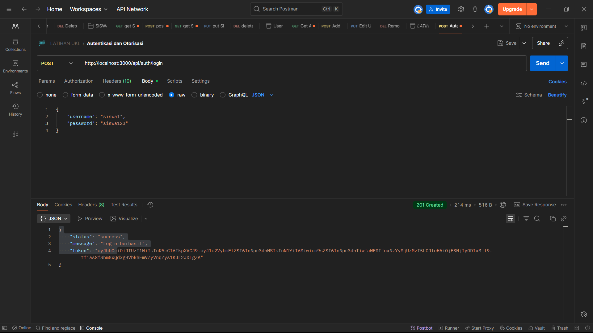
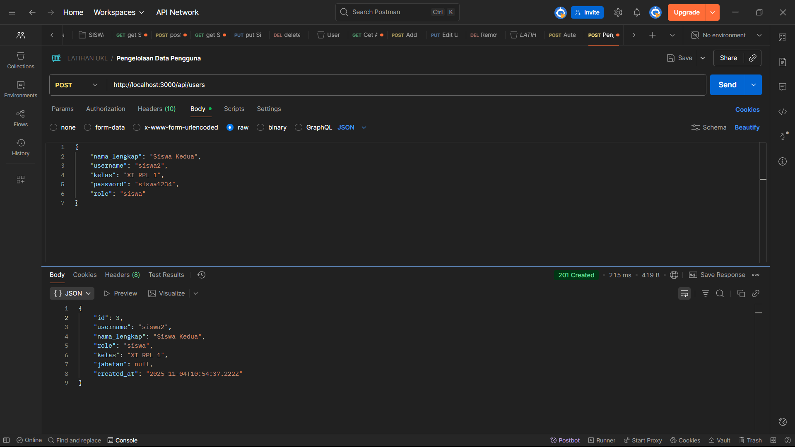
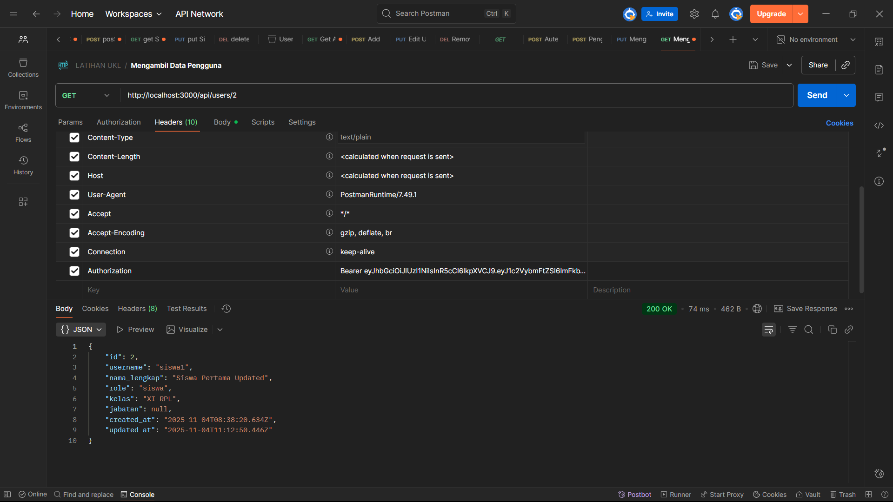
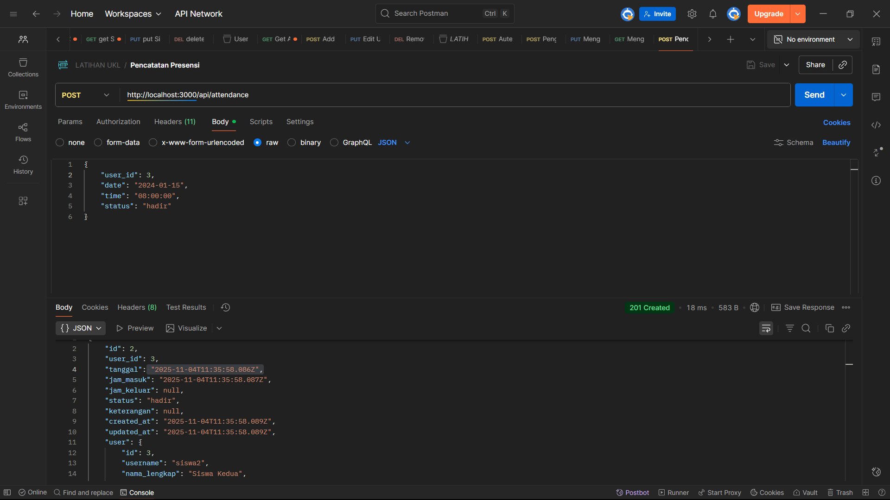
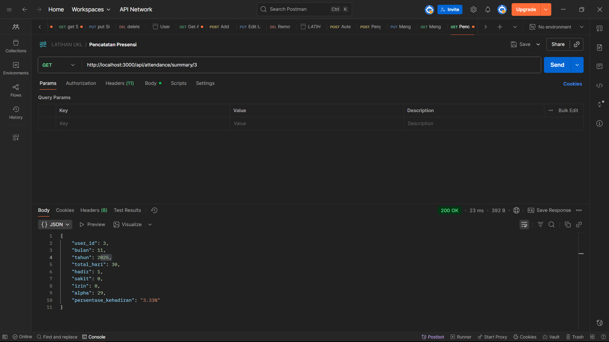

# 📋 Aplikasi Presensi Online - UKL XI RPL

## 📖 Deskripsi Project
Aplikasi Presensi Online adalah **RESTful API** yang dibangun menggunakan **NestJS** dan **Prisma ORM** untuk mengelola sistem presensi digital. Aplikasi ini memungkinkan pencatatan kehadiran pengguna (siswa/karyawan) beserta analisis data kehadiran secara real-time.

## 🚀 Teknologi yang Digunakan
- **Framework**: NestJS
- **Database**: MySQL dengan Prisma ORM
- **Authentication**: JWT (JSON Web Token)
- **Security**: bcryptjs untuk hashing password
- **Testing**: Postman

## 📋 Fitur yang Tersedia

### 1. 🔐 Autentikasi
- Login pengguna dengan username dan password
- Generate JWT token untuk akses API

### 2. 👥 Manajemen Pengguna
- Tambah data pengguna baru (siswa/karyawan)
- Melihat data pengguna
- Update data pengguna
- Mendukung role-based access (siswa/karyawan)

### 3. 📊 Presensi
- Pencatatan kehadiran (check-in)
- Riwayat presensi per pengguna
- Rekap kehadiran bulanan
- Analisis tingkat kehadiran berdasarkan periode

## 🗄️ Struktur Database

### Tabel `users`
- `id` (Primary Key)
- `username` (Unique)
- `password` (Hashed)
- `nama_lengkap`
- `role` (siswa/karyawan)
- `kelas` (untuk siswa)
- `jabatan` (untuk karyawan)

### Tabel `attendances`
- `id` (Primary Key)
- `user_id` (Foreign Key)
- `tanggal`
- `jam_masuk`
- `jam_keluar`
- `status` (hadir/sakit/izin/alpha)
- `keterangan`

## 🔌 Endpoint API

### Autentikasi
| Method | Endpoint | Deskripsi |
|--------|----------|-----------|
| POST | `/api/auth/login` | Login dan mendapatkan token |

### Pengguna
| Method | Endpoint | Deskripsi |
|--------|----------|-----------|
| POST | `/api/users` | Menambah pengguna baru |
| GET | `/api/users` | Mendapatkan semua pengguna |
| GET | `/api/users/:id` | Mendapatkan pengguna by ID |
| PUT | `/api/users/:id` | Mengupdate data pengguna |

### Presensi
| Method | Endpoint | Deskripsi |
|--------|----------|-----------|
| POST | `/api/attendance` | Melakukan presensi |
| GET | `/api/attendance/history/:user_id` | Riwayat presensi |
| GET | `/api/attendance/summary/:user_id` | Rekap bulanan |
| POST | `/api/attendance/analysis` | Analisis kehadiran |

## 🛠️ Instalasi dan Menjalankan

### Prerequisites
- Node.js
- MySQL Database
- XAMPP (opsional)

### Langkah Instalasi
1. **Clone repository**
```bash
git clone <repository-url>
cd presensi-online-ukl
```

2. **Install dependencies**
```bash
npm install
```

3. **Setup database**
```bash
# Generate Prisma client
npx prisma generate

# Push schema ke database
npx prisma db push
```

4. **Jalankan aplikasi**
```bash
# Development mode
npm run start:dev

# Production mode
npm run start:prod
```

5. **Akses aplikasi**
```
http://localhost:3000
```

## 📸 Screenshot Hasil Testing

### 1. Login Berhasil

*Response: Token JWT berhasil di-generate*

### 2. Create User

*Response: User baru berhasil dibuat*

### 3. Get User Data

*Response: Data user berhasil diambil*

### 4. Attendance Check-in

*Response: Presensi berhasil dicatat*

### 5. Attendance History

*Response: Riwayat presensi user*

### 6. Monthly Summary

*Response: Rekap kehadiran bulanan*

### 7. Attendance Analysis

*Response: Analisis tingkat kehadiran*

## 🔐 Cara Penggunaan

### 1. Mendapatkan Token
```bash
POST /api/auth/login
{
  "username": "admin",
  "password": "password123"
}
```

### 2. Menggunakan Token
Setelah login, gunakan token di header:
```
Authorization: Bearer <your-token>
```

### 3. Contoh Request Presensi
```bash
POST /api/attendance
Headers: Authorization: Bearer <token>
{
  "status": "hadir",
  "keterangan": "Hadir tepat waktu"
}
```

## 📊 Contoh Response

### Login Success
```json
{
  "status": "success",
  "message": "Login berhasil",
  "token": "eyJhbGciOiJIUzI1NiIsInR5cCI6IkpXVCJ9..."
}
```

### User Created
```json
{
  "id": 1,
  "username": "siswa1",
  "nama_lengkap": "Siswa Pertama",
  "role": "siswa",
  "kelas": "XI RPL",
  "created_at": "2024-01-15T10:30:00.000Z"
}
```

### Monthly Summary
```json
{
  "user_id": 1,
  "bulan": 1,
  "tahun": 2024,
  "total_hari": 31,
  "hadir": 20,
  "sakit": 2,
  "izin": 1,
  "alpha": 8,
  "persentase_kehadiran": "64.52%"
}
```

## 👨‍💻 Developer
**Nama:** [Nama Anda]  
**Kelas:** XI RPL  
**Sekolah:** [Nama Sekolah]  

## 📄 Lisensi
Project ini dibuat untuk memenuhi tugas **Uji Kenaikan Level (UKL)** Kelas XI RPL.

---

**🎉 Selamat! Aplikasi Presensi Online siap digunakan.**
